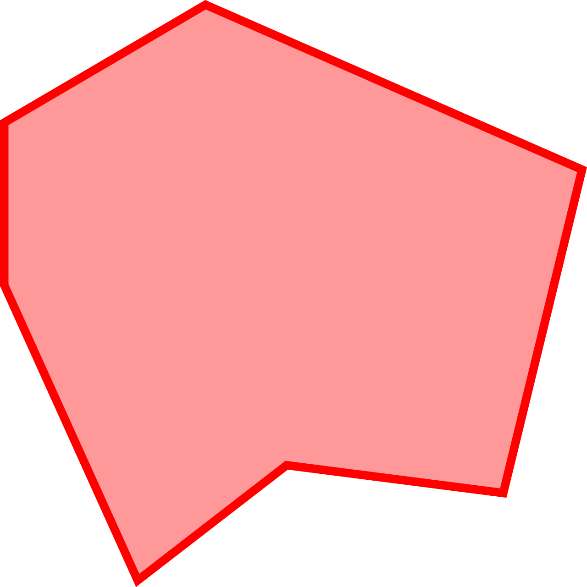

<h1>

Polygons
</h1>

Генерация и перемещение многоугольников между буферной и рабочей зонами.

Демо доступно по ссылке https://chichivika.github.io/polygons/

## Генерация

По нажатию на кнопку "создать" в буферной зоне генерируются многоугольники. Все предыдущие данные из буферной зоны стираются. При изменении размеров окна многоугольники буферной зоны центрируются заново.

*На самом деле, при числе вершин > 3 многоугольники являются звёздными, то есть содержат такую точку во внутренности, что отрезки, соединяющие вершины и эту точку, принадлежат многоугольнику. Совершенно произвольные многоугольники могли бы выглядеть как угодно страшно (пример снизу).

## Работа с многоугольниками
<ul>
    <li>
        Для перетаскивания многоугольников используется левая кнопка мыши. Многоугольники могут располагаться либо в буферной, либо в рабочей зонах. Можно накладывать многоугольники друг на друга.
    </li>
    <li>
        Для зума в рабочей зоне используется ctrl + wheel.
    </li>
    <li>
        Для перемещения по рабочей зоне используется ctrl + левая кнопка мыши.
    </li>
</ul>

## Сохранение / сброс
Кнопка "сохранить" запоминает в local storage следующие параметры: многоугольники буферной зоны, многоугольники рабочей зоны, масштаб рабочей зоны, сдвиг рабочей зоны.

Кнопка "сбросить" сбрасывает все текущие параметры до параметров по умолчанию и очищает local storage.